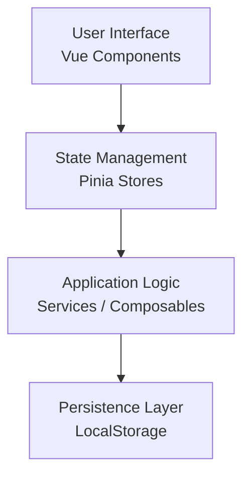
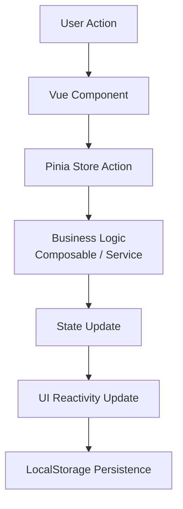

# HomeOps - System Architecture

## 1. System Overview

HomeOps is a modular single-user web application designed to help users manage household responsibilities including cleaning schedules, laundry tracking, and (future) expense management.

The system is designed with scalability in mind, allowing future expansion into multi-device synchronization, backend integration, and mobile applications.

The initial implementation is a frontend-only web application built using Vue 3 and TypeScript.

---

## 2. High-Level Architecture

HomeOps follows a modular frontend architecture:

Each layer is separated to ensure maintainability, scalability, and testability.

---

## 3. Core Modules

The application is divided into domain-based modules:

### 3.1 Dashboard Module
- Provides overview of all active tasks
- Displays overdue and upcoming items
- Acts as the main landing page

---

### 3.2 Cleaning & Maintenance Module
Responsible for household cleaning tasks such as:
- Floor mopping
- Bathroom cleaning
- Vacuuming
- General tidying

Features:
- Task creation and management
- Frequency-based scheduling (daily/weekly/monthly)
- Status tracking (due, completed, overdue)

---

### 3.3 Laundry Module
Tracks laundry cycles for household items:
- Bedsheets
- Pillowcases
- Towels
- Blankets

Features:
- Last cleaned date tracking
- Reminder system based on frequency rules
- Status indicators

---

### 3.4 Expense Module (Future Scope)
Tracks household financial activities:
- Utilities (electricity, water, internet)
- Groceries
- Miscellaneous expenses

Features planned:
- Paid / unpaid tracking
- Monthly summaries
- Category-based filtering

---

### 3.5 Shared Core Module
Provides shared utilities across the system:
- Date utilities
- Status calculation logic (due / overdue)
- Reusable UI components
- TypeScript data models

---

## 4. State Management Strategy

The application uses **Pinia** as the central state management solution.

### State Design Principles:
- Each module has its own store
- Shared state is minimized
- State is normalized (avoid duplication)

### Example Stores:
- useCleaningStore
- useLaundryStore
- useExpenseStore (future)

---

## 5. Data Flow Architecture

The system follows a unidirectional data flow:

This ensures predictable state transitions and easier debugging.

---

## 6. Data Storage Strategy

### Phase 1 (MVP):
- LocalStorage is used for persistence
- Data is stored in JSON format
- No backend dependency

### Phase 2 (Future):
- Migration to backend API (Java Spring Boot or Node.js)
- Database integration (PostgreSQL or Firebase)
- Multi-device synchronization

---

## 7. Key Design Decisions

### 7.1 Frontend-First Architecture
The system is intentionally built as frontend-first to allow rapid development and iteration before introducing backend complexity.

---

### 7.2 Modular Domain-Based Design
Each feature is isolated into modules to ensure:
- scalability
- maintainability
- separation of concerns

---

### 7.3 LocalStorage for MVP
Chosen to:
- reduce complexity
- enable offline usage
- speed up development

---

### 7.4 TypeScript Usage
TypeScript is used to:
- enforce type safety
- improve maintainability
- simulate backend-like data structures on frontend

---

## 8. Future Scalability Plan

The system is designed with future expansion in mind:

### 8.1 Backend Integration
- REST API layer (Java Spring Boot preferred)
- authentication system
- centralized data storage

### 8.2 Multi-Device Support
- user accounts
- cloud synchronization

### 8.3 Mobile Application
- React Native or Flutter extension
- shared backend with web app

### 8.4 Notification System
- reminders for overdue tasks
- email or push notifications

---

## 9. Non-Functional Considerations

- Performance: lightweight frontend, minimal dependencies
- Maintainability: modular structure, clear separation of concerns
- Scalability: backend-ready architecture design
- Usability: minimal UI complexity, fast user interaction flow

---

## 10. Summary

This architecture defines a modular, scalable frontend system designed to manage household operations efficiently while maintaining a clear path for future backend and multi-platform expansion.
